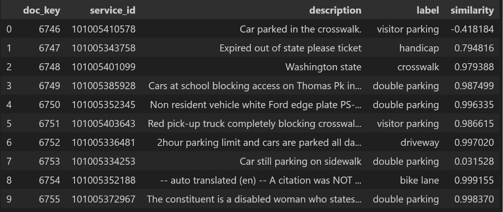
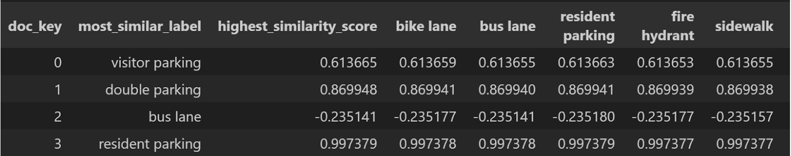

# 311-bike-lane-obstruction-extraction-system: unsupervised text classification
## What is the goal of this project?
Ask anyone who regularly moves about the city on their bike: infrastructure and lanes are often frustratingly blocked by parked vehicles or other obstructions, often in the same spots consistently. In many cities, the most that can be done in the moment is to take a photo and submit a 311 Illegal Parking Report. Even more frustratingly, these reports are not dealt with in a timely manner due to many reasons, with responses of the obstruction being clear sometimes being sent over a week after a report.
**What if there was a way to harness all of this data to better inform engineers of where infrastructure needs to be reinforced?**

The first strategy that was tested was to utilize the [Lbl2Vec](https://wwwmatthes.in.tum.de/file/j6euhpir6wbc/Sebis-Public-Website/-/Semantic-Label-Representations-with-Lbl2Vec-A-Similarity-Based-Approach-for-Unsupervised-Text-Classification/Semantic%20Label%20Representations%20with%20Lbl2Vec.pdf) model, a varient of Word2Vec, where unlabeled text can be classified into multiple classes based on keywords selected to represent the class. The cosine-similarity function is used on the document and label embeddings to determine the best label for the document. 
The current class and keyword breakdown is as shown below:

| Class:                     | Keyword(s):                   |
|----------------------------|-------------------------------|
| Bike lane obstruction      | bike, cycle, path             |
| Bus lane obstruction       | bus, stop                     |
| Non-resident parking       | resident, state               |
| Blocked Fire Hydrant       | fire, hydrant                 |
| Blocked Sidewalk           | sidewalk, side, walk          |
| Blocked Driveway           | driveway, drive, way, private |
| Blocked Crosswalk          | crosswalk, cross, walk        |
| Blocked Handicap Spot      | handicap, placard             |
| Double-Parking             | double, triple                |
| No stopping zone violation | stopping, zone                |
| Visitor Spot               | visitor, hour                 |

## How did the Lbl2Vec Model perform?
Because of the unlabeled nature of the dataset, traditional evaluation metrics such as Accuracy, Precision, Recall, or F1 do not apply. One way to evaluate the effectiveness of the model is through analysis of the clustering of the document and label embeddings. The Silhouette Score is a metric that measures the quality of clustering achieved by the model. It is calculated for each sample and is composed of two distances: a, the mean distance to the other samples in the same cluster (cohesion), and b, the mean distance to the samples in the nearest cluster that the sample is not part of (separation). The silhouette score for a single sample is then given by (b−a)/max(a,b).

Our model achieved a Silhouette Score of 0.70 on the test data, indicating both strong cluster definition and high similarity within these clusters. Cluster definition means on average documents within a cluster are closer to each other than to other clusters, while also suggesting a strong level of separation between the clusters. The high similarity within the clusters is a measure of the cosine similarity between documents within a cluster to those outside a cluster. This indicates cohesion within the clusters. 

However, manual visual inspection of the classification produced by the document is less than ideal. A sample of descriptions from the test data are shown below, alongside their assigned label and the similarity they achieve with that label. There are obvious errors made by the model, and better results could be achieved using a rule based system to search for keywords and variants of keywords. 

Below we can see a sample of the training documents, their assigned label, and their similarities to a subset of the labels. For each document, the variation of the similarities from a given document to each label is very low, often falling below 0.001. In other words, the documents are almost just as close to every possible label.

## What is the current status of the project?
The current phase being worked on is model evaluation and hyperparameter tuning. Because of the unlabeled nature of the data, evaluation is being done of models through evaluation of labels for ground-truth subsets for each class. The amount of classes and keywords for each class are also being examined during this process, as they can influence the performance of the Lbl2Vec model.
